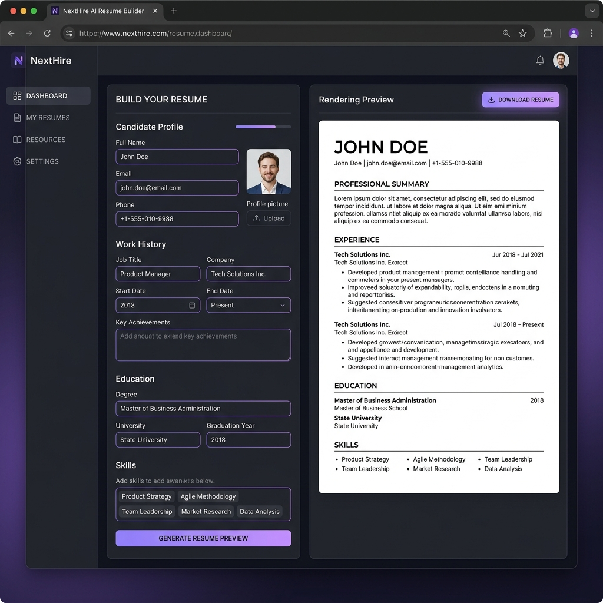

# NextHire AI

> **Smart Resumes. Stunning Portfolios. Better Careers.**

NextHire AI is a modern, premium dark-themed career optimization platform designed to empower job seekers. By leveraging advanced artificial intelligence, NextHire AI helps users build ATS-friendly resumes, analyze resume scores against target roles, generate custom cover letters, and instantly publish stunning web portfolios.

---

## 🔗 Live Deployments & Badges

[](https://next-hire-ai-puce.vercel.app)
[](https://github.com/vivektripathi0320-web/NextHire-AI)

---

## 📝 Project Overview

NextHire AI is a full-stack SaaS application that automates the tedious parts of job hunting. By combining a React + TypeScript frontend with a Python FastAPI backend and the Google Gemini API, it provides a comprehensive workspace where candidates can import their career history once, optimize it dynamically for every application, and share their professional profiles via beautiful, hosted web portfolios.

---

## ⚠️ Problem Statement

Modern job seekers face significant friction when navigating the hiring pipeline:
- **ATS Filtering Barriers**: Over 75% of resumes are filtered out automatically by Applicant Tracking Systems (ATS) before reaching human eyes. Candidates struggle to identify missing keywords and formatting issues.
- **Manual Portfolio Overhead**: Setting up a personal portfolio website from scratch requires web development experience, domain hosting, design choices, and hours of configuration.
- **Resume Customization Fatigue**: Tailoring resume bullet points, summaries, and skill lists for dozens of different job descriptions is tedious, error-prone, and time-consuming.
- **Generic Cover Letters**: Writing customized, role-aligned cover letters for each application is mentally exhausting, often resulting in generic templates that fail to engage recruiters.

---

## 💡 Proposed Solution

NextHire AI provides an integrated, AI-guided hub:
1. **Zero-Effort Extraction**: Upload an existing resume (PDF or text), and the AI automatically extracts work history, skills, and projects into structured JSON data.
2. **Context-Aware Matching**: Paste any job description to get a real-time matching score, keyword breakdown, and suggestions.
3. **Instant Portfolio Generation**: Instantly turn structured profile data into a responsive, live-hosted web portfolio without writing a single line of code.
4. **Tailored Writing Assistants**: Generate tailored cover letters and resume summaries optimized specifically for the target job description.

---

## ✨ Core Features

*   **AI Resume Builder**: Design and customize professional, ATS-compliant resumes with responsive, download-ready layouts.
*   **Resume Upload & Information Extraction**: Drag-and-drop resumes to parse and pre-populate your profile using Gemini NLP.
*   **ATS Score Analyzer**: Receive a score out of 100, dynamic feedback, and active verb recommendations.
*   **Resume vs Job Description Matcher**: Compare your qualifications side-by-side with target job descriptions to identify skill gaps.
*   **AI Cover Letter Generator**: Generate professional, persuasive cover letters customized for specific job roles and companies.
*   **Portfolio Generator**: Auto-compile resume data into a shareable web portfolio page with visual themes.

---

## 🛠️ Technology Stack

*   **Frontend**: React (Vite), TypeScript, Tailwind CSS, Framer Motion
*   **Backend**: FastAPI (Python), Uvicorn Server
*   **Database & ORM**: SQLite, SQLAlchemy ORM
*   **AI Engine**: Google Gemini API (`gemini-2.0-flash`)
*   **Deployment**: Vercel (Frontend), Render (Backend with SQLite persistent disk)

---

## 📊 System Architecture

The application is built on a decoupled client-server architecture:
1. **Frontend (Vite + React SPA)**: Handles responsive layout rendering, visual theme states, and client-side form updates.
2. **Backend (FastAPI REST API)**: Manages database connections, processes file uploads, and acts as the gatekeeper for Gemini API prompting.
3. **AI Pipeline (Google Gemini API)**: Receives prompt templates, processes resume bullet points, parses text, and returns structured JSON responses.


---

## 📸 Product Screenshots

Here is a visual walk-through of the NextHire AI workspace:

### 1. Landing Page
The entry point featuring clean, dark-themed branding, modern gradients, and quick navigation.


### 2. AI Resume Builder
The interface for editing, structuring, and customizing resume text fields and downloading layouts.


### 3. ATS Analyzer & JD Matcher
Get real-time feedback, matching scores, and keyword audits against targeted roles.


### 4. Portfolio Generator
Convert your resume profile into a live-rendered web portfolio website with customizable templates.


### 5. Cover Letter Generator
Generate customized, company-specific cover letters that align with your resume and target role.


---

## 💻 Installation Guide

Follow these steps to run NextHire AI locally on your system.

### Prerequisites
- Node.js (v18 or higher)
- Python (v3.9 or higher)
- A Google Gemini API Key (obtained from [Google AI Studio](https://aistudio.google.com/))

### Step 1: Clone the Repository
```bash
git clone https://github.com/vivektripathi0320-web/NextHire-AI.git
cd NextHire-AI
```

### Step 2: Configure Environment Variables
Copy the template file to `.env` in the root folder:
```bash
cp .env.example .env
```
Open the `.env` file and insert your Gemini API Key:
```text
GEMINI_API_KEY="your-actual-api-key"
```

### Step 3: Run the Backend Server
```bash
# Move to backend directory
cd backend

# Create virtual environment
python -m venv .venv

# Activate virtual environment
# On Windows (PowerShell):
.venv\Scripts\Activate.ps1
# On macOS/Linux:
source .venv/bin/activate

# Install dependencies
pip install -r requirements.txt

# Run server (runs on http://localhost:8000)
python main.py
```

### Step 4: Run the Frontend Client
Open a new terminal window in the project root:
```bash
# Move to frontend directory
cd frontend

# Install packages
npm install

# Run dev server (runs on http://localhost:5173)
npm run dev
```

Now open `http://localhost:5173` in your browser.

---

## 💡 Usage Guide

Here is how to navigate the core candidate journey in NextHire AI:

1.  **Upload / Import Resume**:
    - Click **Upload Resume** on the dashboard.
    - Upload your PDF file. The FastAPI backend extracts text, sends it to Gemini, and returns structured JSON to pre-populate all fields.
2.  **Generate / Edit Resume**:
    - Navigate to the **Resume Builder**.
    - Modify sections (Experience, Projects, Education) and use the **Enhance Bullet Points** tool to polish descriptions.
3.  **Run ATS Analysis**:
    - Navigate to the **ATS Score Analyzer**.
    - Paste the target Job Description in the text block and click **Analyze**.
    - View matching score, missing keywords, and recommended action verbs.
4.  **Generate Cover Letter**:
    - Navigate to the **Cover Letter Generator**.
    - Insert the Target Company Name and Role Title. Click **Generate** to get a custom cover letter.
5.  **Generate Portfolio**:
    - Click **Generate Portfolio**.
    - Choose a theme template (e.g. Classic Dark, Modern Minimal).
    - Preview the live portfolio, copy the public link, or download the design.

---

## 🚀 Deployment Information

NextHire AI is set up for automatic production deployment:

### Frontend (Vercel)
- **Framework Preset**: Vite
- **Root Directory**: `frontend/`
- **Environment Variable**: `VITE_API_BASE_URL` pointing to your deployed backend URL.
- **Routing Rules**: Handled in `vercel.json` to route client-side router requests to `index.html`.

### Backend (Render)
- **Runtime**: Python (FastAPI)
- **Root Directory**: `backend/`
- **Build Command**: `pip install -r requirements.txt`
- **Start Command**: `uvicorn app.main:app --host 0.0.0.0 --port $PORT`
- **Persistent Disk**: Render mounts a 1GB SSD persistent volume under `/data` to store the SQLite `nexthire.db` database file, preserving state across server restarts.
- **Environment Variables**:
  - `DATABASE_URL=sqlite:////data/nexthire.db` (Points to persistent storage volume)
  - `GEMINI_API_KEY=your_gemini_key`
  - `ENV=production`

---

## 📈 Future Scope

We plan to expand NextHire AI with the following advanced modules:
*   **Kanban Application Tracker**: Track job applications through stages (Applied, Screened, Technical Interview, Offer, Rejected) in a drag-and-drop board.
*   **Portfolio Design Theme Marketplace**: Add premium customizable templates with CSS styling frameworks.
*   **GitHub & LinkedIn Sync**: Enable single-click profile importing directly from GitHub repositories and LinkedIn profiles.
*   **Gemini Interview Coach**: Provide interactive voice-and-text mock interview simulators based on resume content.
*   **Multi-language Resume Builder**: Support translation and resume writing in German, French, Hindi, and Spanish.
*   **Recruiter Portal**: Introduce candidate dashboards where recruiters can search, filter, and shortlist candidate portfolios.
*   **Skill Gap Analysis**: Provide links to courses or certifications based on missing ATS keywords.

---

## 👤 Author

**Vivek Tripathi**
- GitHub: [@vivektripathi0320-web](https://github.com/vivektripathi0320-web)
- Role: Full-Stack Developer & AI Engineer

---

## 📄 License

This project is licensed under the MIT License - see the LICENSE file for details.
