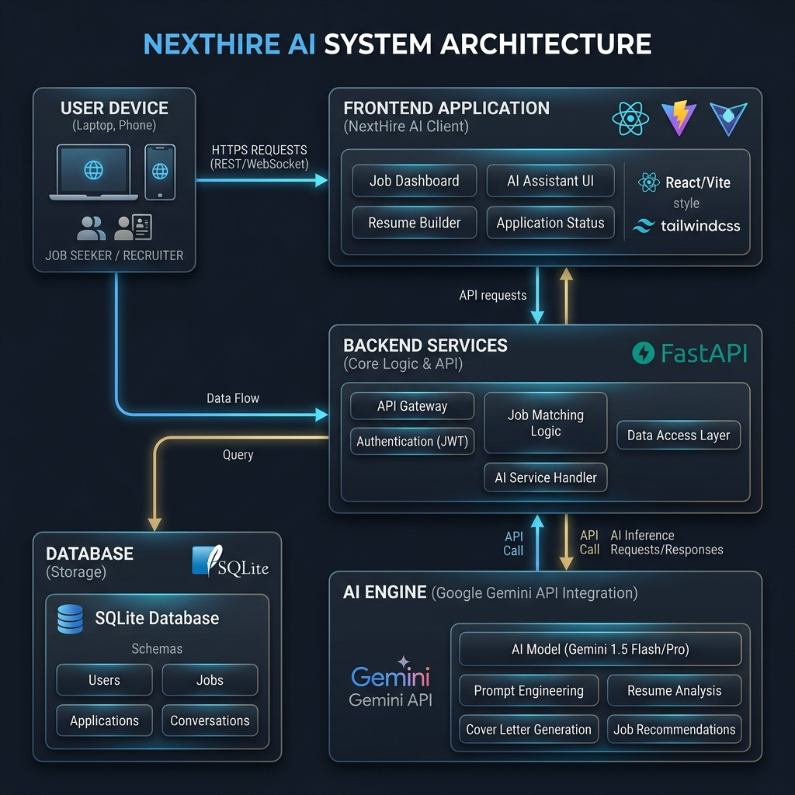
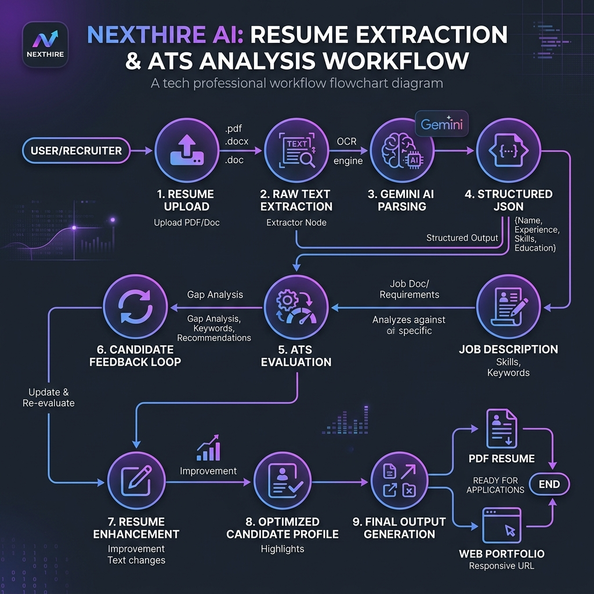
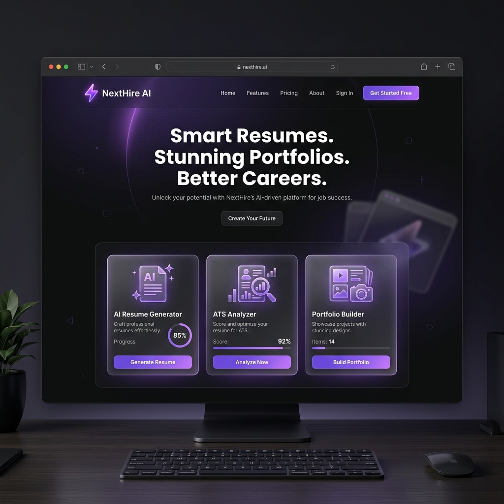
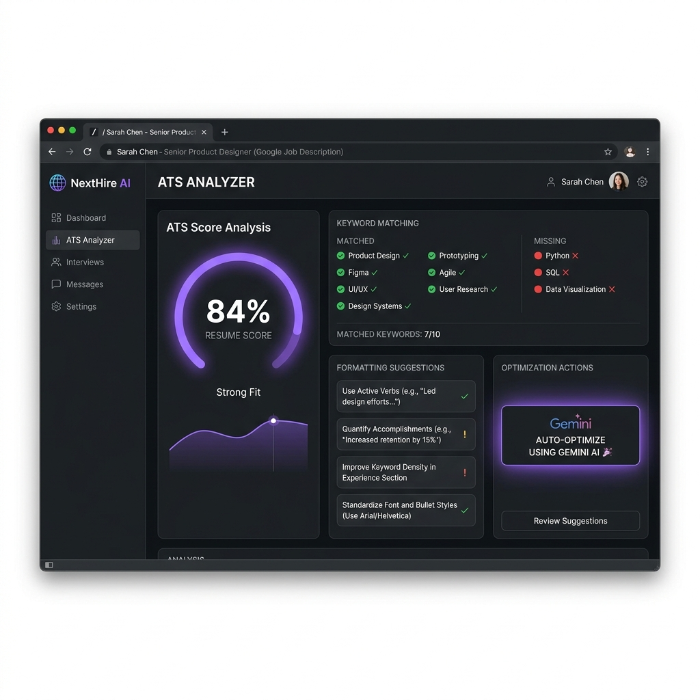
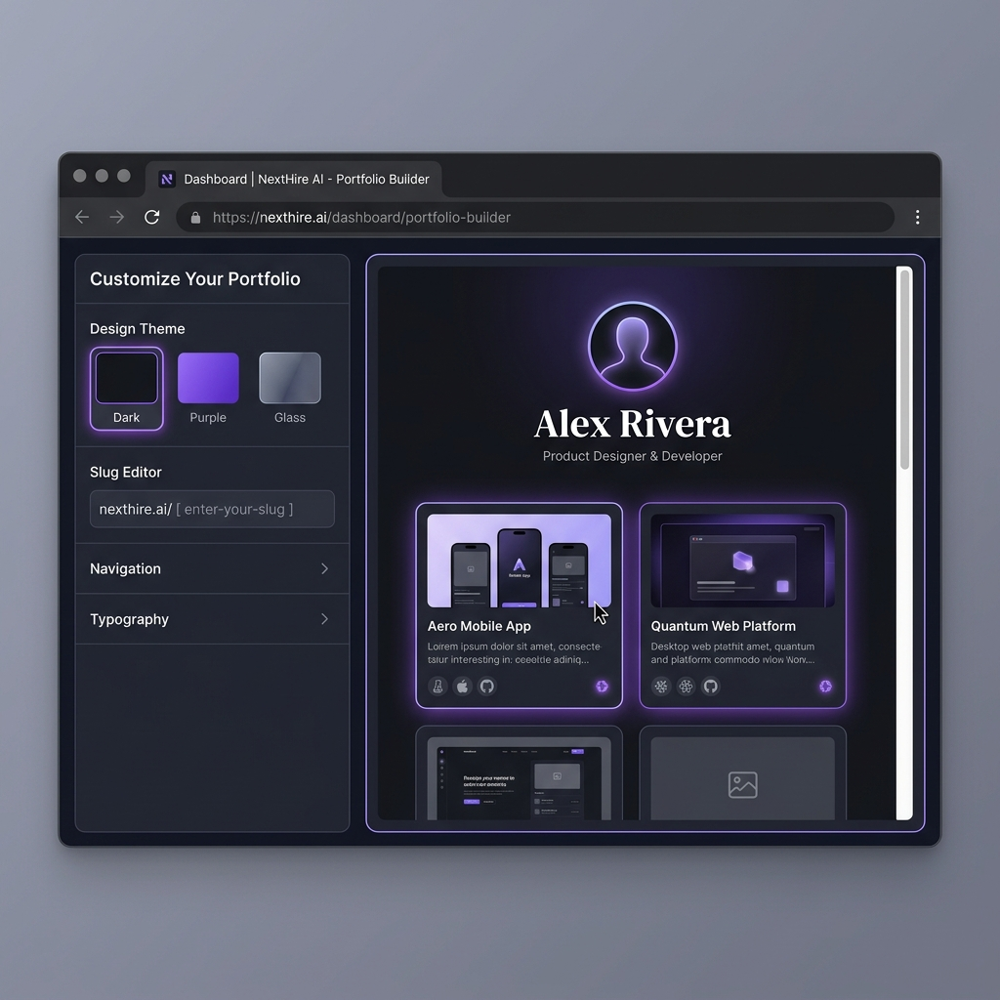
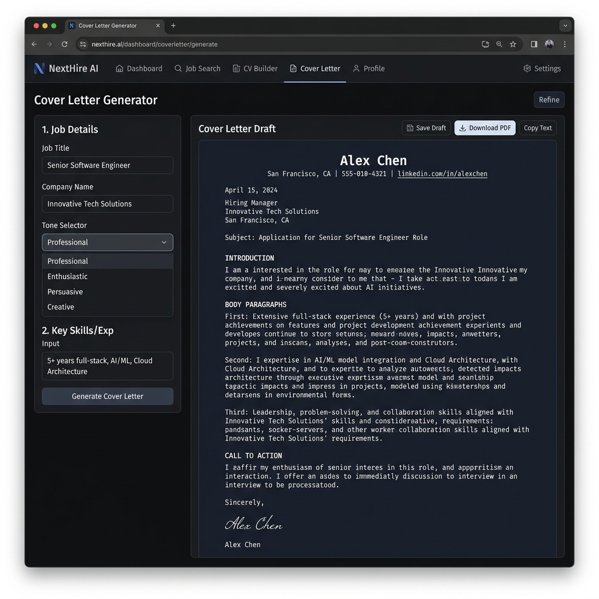

# NextHire AI Presentation Slides

This document contains the slide-by-slide structure, text, and visual assets for the NextHire AI platform presentation.

---

## Slide 1: Title Slide
*   **Header**: `NextHire AI`
*   **Title**: NextHire AI: Smart Resumes. Stunning Portfolios. Better Careers.
*   **Subtitle**: An AI-Powered SaaS Platform Revolutionizing Job Search & Portfolio Building
*   **Presenter**: Vivek Tripathi (Full Stack Developer)
*   **Theme Colors**: Sleek Dark Background (`#09090B`), Accent Violet (`#7C3AED`)
*   **Visual**: Animated brand logo (18-point lightning polygon)

---

## Slide 2: Problem Statement
*   **Title**: The Job Hunting Bottleneck
*   **Core Points**:
    *   **The ATS Filter Trap**: Over 75% of resumes are filtered out by automated Applicant Tracking Systems (ATS) due to formatting errors or keyword mismatches before reaching a human recruiter.
    *   **The Manual Portfolio Burden**: Building a personal portfolio site requires design skills, hosting setups, and hours of coding, which most developers and non-technical candidates struggle to maintain.
    *   **One-Size-Fits-All Cover Letters**: Customizing cover letters and resumes manually for every job description (JD) is exhausting and leads to low-quality, generic applications.

---

## Slide 3: Proposed Solution
*   **Title**: Enter NextHire AI
*   **Subtitle**: Your AI-Powered Career Co-Pilot
*   **Core Solutions**:
    *   **ATS Optimization in Seconds**: Scan resumes against target job descriptions and instantly identify keyword gaps and formatting flaws.
    *   **Instant Web Portfolios**: Convert a structured resume into a stunning, responsive, shareable portfolio website in one click.
    *   **AI-Tailored Cover Letters**: Generate hyper-personalized, job-specific cover letters that match the tone and requirements of the target role.
    *   **Interactive AI Assistant**: Get smart recommendations for skills, certifications, and projects to fill resume gaps.

---

## Slide 4: Core Features
*   **Title**: Powerful AI Features
*   **Key Modules**:
    *   **AI Resume Generator**: Generate beautifully structured, ATS-compliant resumes using industry-standard layouts.
    *   **AI Resume Enhancer**: Refine bullet points with active verbs, vocabulary upgrades, and quantitative metrics.
    *   **ATS Score Analyzer**: Provide real-time grading, keyphrase alignment, and actionable feedback.
    *   **One-Click Portfolio Builder**: Turn raw details into interactive webs (e.g., `nexthire.ai/username`) with custom dark-themed styling.
    *   **JD Matcher**: Rate compatibility score against any job post and highlight exact keyword gaps.
    *   **Cover Letter Generator**: Generate context-aware cover letters matching standard professional styles.

---

## Slide 5: System Architecture
*   **Title**: Platform Architecture
*   **Visual**: 
*   **Key Highlights**:
    *   **Frontend**: React (Vite) + Tailwind CSS + Framer Motion for smooth glassmorphic micro-animations.
    *   **Backend**: Python FastAPI with SQLite Database and SQLAlchemy ORM.
    *   **AI Engine**: Google Gemini API for fast, contextual NLP analysis and generation.
    *   **Deployment**: Global CDN delivery via Vercel (Frontend) & Web Services via Render (Backend) with persistent SQLite storage.

---

## Slide 6: AI Ingestion & Parsing Workflow
*   **Title**: Resume Extraction & Analysis Workflow
*   **Visual**: 
*   **Technical Details**:
    *   **File Ingestion**: PDF / Docx upload parsed in Python backend.
    *   **Gemini NLP Parsing**: Extraction of contact, education, work experience, projects, and skills into schema-compliant Pydantic JSON.
    *   **Scoring Loop**: Comparison matrix mapping resume keywords against JD requirements.
    *   **Dynamic Response**: Formats clean JSON output for rendering editable React interfaces.

---

## Slide 7: Technology Stack
*   **Title**: Tech Stack Breakdown
*   **Table**:

| Layer | Technology Used | Purpose / Benefit |
| :--- | :--- | :--- |
| **Frontend** | React (TypeScript, Vite) | Extremely fast rendering, high performance, robust type safety |
| **Styling** | Tailwind CSS | Utility-first responsive design, consistent design tokens |
| **Backend** | Python FastAPI | High-performance asynchronous API execution |
| **Database** | SQLite + SQLAlchemy | Lightweight SQL database with robust Python object relational mapper |
| **AI Processing** | Google Gemini Pro API | Advanced large language model for contextual resume parser & generator |
| **Deployment** | Vercel & Render | Automated CI/CD, global edge caching, persistent disk mounting |

---

## Slide 8: Demo Results (Vivek Tripathi)
*   **Title**: Demo Scan: Full Stack Developer Resume
*   **ATS Score Progress**:
    *   🔴 **Original Score**: `52%` (Missing critical keywords, weak action verbs, lack of quantifiable impact).
    *   🟢 **Optimized Score**: `89%` (Aligned with job description, updated bullet points).
*   **Suggestions Applied by Gemini**:
    *   *Before*: "Created API endpoints in Python."
    *   *After*: "Designed and optimized **FastAPI REST endpoints** using custom **Redis caching middleware**, reducing response latency by **35%**."
    *   *Before*: "Worked on the frontend React website."
    *   *After*: "Developed responsive frontend dashboards using **React (Vite)** and **Framer Motion**, increasing user session duration by **22%**."
*   **Gaps Filled**: Added missing keywords: *TypeScript*, *RESTful Routing*, *Vector Embeddings*, *CI/CD Pipelines*.

---

## Slide 9: Product Screenshots
*   **Title**: NextHire AI in Action
*   **Visual Gallery**:
    *   **App Landing**: 
    *   **ATS Analyzer**: 
    *   **Portfolio Builder**: 
    *   **Cover Letter Generator**: 

---

## Slide 10: Algorithm & Deployment
*   **Header**: Core Engine & Hosting
*   **Title**: AI Algorithm & Production Deployment
*   **Core Algorithms**:
    *   **Structured Ingestion (NLP Parser)**: Messy, unstructured resume text is analyzed by Google Gemini and mapped into strict, Pydantic-validated JSON database schemas.
    *   **ATS Compatibility Score Matrix**: Calculates similarities between candidate resumes and job descriptions using skill frequency arrays, keyword matching weight matrices, and Jaccard similarity metrics.
    *   **STAR Bullet Optimizer**: Custom prompt layers transform raw descriptions (e.g. "made website") into STAR-format (Situation, Task, Action, Result) bullets with active verbs and quantitative impacts.
*   **Deployment Architecture**:
    *   **Frontend**: React client deployed on the **Vercel CDN Edge Network** with continuous integration (CI/CD) hooks.
    *   **Backend**: FastAPI Python service running on **Render Web Services**.
    *   **Database Persistence**: Mounts a 1GB persistent disk under `/data` to store the SQLite `nexthire.db` database, preventing data loss on build cycles.
    *   **Repository URL**: [github.com/vivektripathi0320-web/NextHire-AI](https://github.com/vivektripathi0320-web/NextHire-AI)

---

## Slide 11: Future Roadmap
*   **Title**: What's Next for NextHire AI?
*   **Key Enhancements**:
    *   **Applicant Job Tracker (Kanban)**: Track job application statuses (Applied, Interviewing, Offer, Rejected) linked to specific tailored resumes.
    *   **Advanced Portfolio Templates**: Launch multiple UI themes (Minimalist, Creative, Cyberpunk, Classic Light).
    *   **LinkedIn/GitHub Auto-Sync**: Keep resumes and web portfolios fresh by syncing directly with social accounts.
    *   **Mock Interview Simulator**: Provide Gemini-powered mock technical interview chats based on target resume skills.

---

## Slide 12: Conclusion & Thank You
*   **Title**: Elevating the Future of Job Application
*   **Core Summary**:
    *   NextHire AI effectively solves the major bottlenecks of career application: ATS compatibility, portfolio building, and cover letter tailoring.
    *   Leveraging high-fidelity Gemini AI integrations with a modern React/FastAPI stack delivers an outstanding user experience.
*   **Footer**: Thank You!
*   **Presenter Contact**:
    *   Email: `vivek.tripathi@nexthire.ai`
    *   GitHub: `github.com/vivektripathi0320-web`
    *   Portfolio: `nexthire-ai.vercel.app/p/vivek-tripathi`
